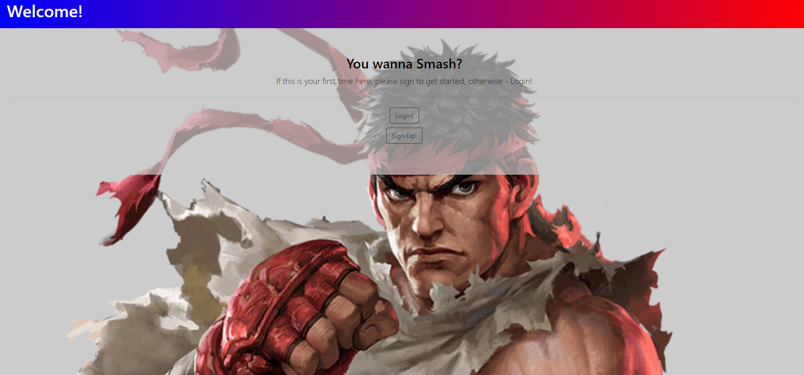

  # Smash.ME

  

  ## Table of Contents:

  * [Description](#Description)

  * [Motivation](#Motivation)

  * [Features](#Features)

  * [Contributions](#Contributions)

  * [Website](#Website)

  * [Email](#Questions)

  * [Github](#Questions)

  ## Description: 
  The app will allow users to create esports profiles to share with potential recruiters for collegiate esports scholarship opportunities

  ## Motivation: 
  The aim was to educate parents, high schoolers of the esports growth within the collegiate arena and the scholarship potential
  
  ## Features: 
  * eSports Profile creation
  * National Assoc of Collegiate eSports reourse access
  * NCSA recruiting resource access
  

  ## Website:
  https://supersmashme.herokuapp.com/
  

  ## Contributions: 
  * John Evenden (https://github.com/Jevenden)
  * Gabriel Adams Bogar (https://github.com/gabeab34)
  * Richard Tran (https://github.com/rtran1029)
  * Connor Breslin (https://github.com/CTBreslin)
  * Jesus Velez (https://github.com/JVelezFD)

  ## Website: 
  

  ## Questions:

  [Email](mailto:gabeab34@gmail.com)

  [GitHub](https://github.com/gabeab34)

